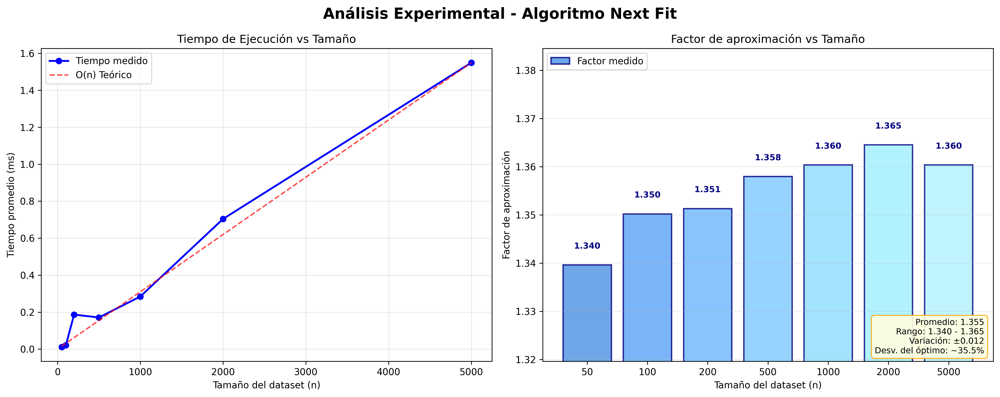

# 3. Problema 3

## 3.1 Enunciado

Tenemos un conjunto de n objetos, donde el tamaño $s_i$ del i-ésimo objeto cumple que $0<s_i<1$. El objetivo es empaquetar todos los objetos en el mínimo número posible de recipientes de tamaño unitario: cada recipiente puede contener cualquier subconjunto de los objetos cuyo tamaño total no exceda 1. El problema así planteado es NP-Hard (Karp, 1972).

Se desea encontrar un algoritmo eficiente que encuentre una solución aproximada con una garantía de a lo sumo 2 veces el valor de la solución óptima.

## 3.2 Análisis

### 3.2.1 Supuestos, Condiciones y Limitaciones

- El algoritmo procesa los objetos en el orden dado sin reordenarlos (Next Fit; Johnson, 1973).

- Los tamaños $s_i$ son constantes, $0 < s_i < 1$, y no pueden  dividirse ni deformarse.

- Todos los recipientes tienen capacidad $C = 1$.

### 3.2.2 Espacio de Soluciones Factibles

El problema planteado es una variante del _Bin Packing Problem_. Si se intentara resolverlo mediante fuerza bruta para encontrar el óptimo global, se tendría que evaluar todas las posibles asignaciones de $n$ elementos en $k$ recipientes.

El espacio de particiones de $n$ elementos crece según los Números de Bell $B(n)$, con comportamiento asintótico $B(n) \sim (n/\ln n)^n$ (Rosen, 2019). Este crecimiento super-exponencial refuerza la inviabilidad de fuerza bruta en instancias grandes para un problema NP-Hard (Karp, 1972), justificando una heurística con garantía.

<!-- El espacio de soluciones crece según los Números de Bell $B(n)$. Su comportamiento asintótico es del tipo $(n/\ln n)^n$ (Rosen, 2019). Al tener la variable $n$ tanto en la base como en el exponente, este crecimiento es superior al exponencial simple $(c^n)$ y se asemeja más a un crecimiento factorial $(n!)$.  -->

Por ejemplo, para valores pequeños de $n$, la cantidad de combinaciones explota rápidamente, haciendo que un enfoque exacto sea computacionalmente inviable (NP-Hard) para conjuntos de datos grandes. Esto justifica la necesidad de un algoritmo de aproximación eficiente como alternativa práctica.

## 3.3. Diseño

### 3.3.1 Algoritmo Propuesto

Se implementa Next Fit por su simplicidad y garantía $2$-aproximada (Johnson, 1973; Coffman et al., 1997).

La estrategia consiste en mantener abierto únicamente el recipiente actual. Si el siguiente objeto cabe en él, se coloca allí; de lo contrario, se cierra el recipiente actual (no se vuelve a usar) y se abre uno nuevo para el objeto.

### 3.3.2 Pseudocódigo

```py
FUNCION next_fit(items S):
    # inicializar lista de recipientes R = [r1]
    j = 1
    PARA CADA item s_i EN S:
        SI s_i cabe en r_j:
            # agregar s_i a r_j
        SINO:
            j += 1
            # crear r_j y agregar s_i
    RETORNAR j
```

<!-- ```py
FUNCION next_fit(items S):
    # inicialiazar un lista de recipientes R = {r_1}
    j = 1 # índice del recipiente actual

    PARA CADA item s_i EN S:
        SI s_i entra en el recipiente r_J:
            # colocar s_i en r_j
        SINO:
            # cerrar r_j
            # crear nuevo recipiente r_{j+1}
            j += 1
            # colocar s_i en r_j

    RETORNAR j # cantidad de recipientes usados
``` -->

### 3.3.3 Garantía de Aproximación

El algoritmo de _Next Fit_ garantiza que la cantidad de recipientes utilizados nunca excede el doble de la cantidad óptima de recipientes.

**Teorema:** Para cualquier lista de ítems \(L\) se cumple \(NF(L) \le 2 \cdot OPT(L)\) (Johnson, 1973; Coffman et al., 1997; Kleinberg & Tardos, 2006).

<!-- **Teorema:** Para cualquier lista de ítems $L$, sea $NF(L)$ la cantidad de recipientes usados por _Next Fit_ y $OPT(L)$ la cantidad óptima. Entonces: $NF(L) \le 2 \cdot OPT(L)$. -->

**Demostración:** Sea \(k = NF(L)\). Denotemos como \(C(R_i)\) la suma de tamaños de los ítems en el recipiente \(R_i\). El algoritmo abre el recipiente \(R_{i+1}\) sólo cuando el primer ítem que irá allí (llamémoslo \(x_{i+1}\)) no entra en \(R_i\). Por lo tanto para cada \(i\) con \(1 \le i \le k-1\):

\[C(R_i) + x_{i+1} > 1\]

y como \(C(R_{i+1}) \ge x_{i+1}\), se obtiene \[C(R_i) + C(R_{i+1}) > 1 \quad (1 \le i \le k-1)\].

Tomando pares alternados disjuntos hay al menos \(\left\lfloor\frac{k-1}{2}\right\rfloor\) de ellos, así:

\[S(L) = \sum_{j=1}^k C(R_j) > \frac{k-1}{2}\]

Dado que cada recipiente aporta a lo sumo 1 unidad de capacidad:

\[OPT(L) \ge S(L) > \frac{k-1}{2} \;\Longrightarrow\; k < 2\cdot OPT(L)+1 \;\Longrightarrow\; k \le 2\cdot OPT(L)\]

Concluye que *Next Fit* es un algoritmo \(2\)-aproximado.

<!-- Puesto que $C(R_{i+1}) \ge x_{i+1}$, se obtiene para cada par consecutivo (salvo quizás el último):

\[C(R_i) + C(R_{i+1}) > 1\]

Tomando pares alternados (al menos $[\frac{k-1}{2}]$ pares disjuntos), al sumar todos los contenidos:

\[S(L) = \sum_{j=1}^k C(R_j) > \frac{k-1}{2}\]

Como cada recipiente en cualquier solución óptima tiene a lo sumo capacidad 1, se cumple:

\[OPT(L) \ge S(L) > \frac{k-1}{2} \;\;\Longrightarrow\;\; k < 2\cdot OPT(L) + 1\]

Por integralidad:

\[k \le 2 \cdot OPT(L)\]

Se concluye que *Next Fit* es un algoritmo 2-aproximado (Johnson, 1973). -->

<!-- La lógica del algoritmo dicta que un nuevo recipiente $R_{i+1}$ solo se abre si el item actual no cabe en el recipiente $R_i$. Esto implica que la suma del contenido de los recipientes adyacentes cualesquiera debe ser extrictamente mayor a la capacidad unitaria del recipiente (que es 1). Si fuera menor o igual a 1, el algoritmo habría colocado primer item del recipiente $i+1$ en el recipiente $i$.

$C(R_i) + C(R_{i+1}) > 1 \text{, para } 1 \le i \le k$

Si se suma el contenido de todos los recipientes, se tiene la suma total de los tamaños de los ítems, denotada como $S(L)$. Dado que al menos la mitad de los pares de recipientes suman más de 1, se puede acotar el tamaño total: $S(L) > \frac{k-1}{2}$.

Se sabe que el número óptimo de recipientes $OPT(L)$ debe ser al menos igual al tamaño total de los ítems (ya que la capacidad máxima es 1): $OPT(L) \geq S(L)$.

Combinando ambas desigualdades: $OPT(L) > \frac{k-1}{2} \Longrightarrow 2 \cdot OPT(L) > k-1$

Dado que $k$ y $OPT(L)$ son enteros, esto implica que $k \le 2 \cdot OPT(L)$ (Kleinberg & Tardos, 2006). -->

### 3.3.4 Estructuras de Datos Utilizadas

La ausencia de búsqueda entre recipientes cerrados elimina la necesidad de estructuras más complejas (Coffman et al., 1997).

Para la implementación del algoritmo _Next Fit_, se han seleccionado estructuras de datos lineales simples.
Dado que la lógica del algoritmo es estrictamente secuencial y online (no revisa decisiones pasadas ni mira hacia el futuro), no se requieren estructuras de acceso aleatorio complejo ni de ordenamiento.

1. **Arreglo Dinámico / Lista (para la entrada)**
- **Descripción:** Se utiliza una lista (implementada como list en Python) para almacenar la secuencia de objetos de entrada $S$.
- **Justificación:** El algoritmo requiere recorrer los elementos una única vez en el orden dado. La lista permite iteración secuencial en tiempo $O(N)$. Al no requerir reordenamiento (como en _Decreasing First Fit_), no se incurre en costos adicionales de procesamiento previo.

2. **Lista de listas (para la salida)**
- **Descripción:** La estructura principal de retorno es una lista donde cada elemento es, a su vez, una lista que representa un recipiente conteniendo los tamaños de los objetos asignados.
- **Justificación:**
    - **Eficiencia Espacial:** Esta estructura crece dinámicamente según la cantidad de recipientes necesarios $(k)$, evitando reservar memoria para el peor caso ($n$ recipientes).
    - **Acceso Local:** El algoritmo _Next Fit_ solo necesita interactuar con el último recipiente creado (el "recipiente actual"). El acceso al último elemento de una lista y la inserción de un nuevo elemento al final (append) son operaciones de tiempo constante amortizado $O(1)$.

#### Justificación de la Ausencia de Estructuras Complejas:
A diferencia de algoritmos como _First Fit_ o _Best Fit_, que deben buscar entre todos los recipientes abiertos para encontrar espacio disponible (lo que justificaría el uso de Árboles Binario de Búsqueda o Heaps Maximales para optimizar la búsqueda a $O(log(n))$), *Next Fit* descarta inmediatamente cualquier recipiente cerrado. Al eliminar la necesidad de búsqueda histórica, una estructura lineal simple es suficiente y garantiza la complejidad temporal $O(N)$ y la mínima sobrecarga de memoria (overhead). 

## 3.4 Seguimiento

El siguiente ejemplo ilustra la mecánica básica de *Next Fit* tal como se describe en Johnson (1973).

Para el conjunto \(S = [0.6, 0.3, 0.7, 0.2, 0.1]\) y capacidad \(C = 1\):

##### Tabla de seguimiento:

| Paso | Objeto($s_i$) | Estado Recipiente Actual (Espacio Libre) | ¿Entra? | Acción | Estado Final de Recipientes
|:------:|:---------------:|:----------------------------:|:-------:|:---------:|:--------:|
| Inicio | - | Recipiente 1 (Libre: 1.0) | - | Inicializar | [R1(0.0)] |
| 1 | 0.6 |R1 (Libre: 1.0) | Sí ($0.6 \le 1.0$) | Agregar a R1 | [R1(0.6)] |
| 2 | 0.3 | R1 (Libre: 0.4) | Sí ($0.3 \le 0.4$) | Agregar a R1 | [R1(0.6, 0.3)] |
| 3 | 0.7 | R1 (Libre: 0.1) | No ($0.7 > 0.1$) | Cerrar R1. Abrir R2. Agregar a R2 | [R1(Cerrado), R2(0.7)] |
| 4 | 0.2 | R2 (Libre: 0.3) | Sí ($0.2 \le 0.3$) | Agregar a R2 | [R1(Cerrado), R2(0.7, 0.2)] |
| 5 | 0.1 | R2 (Libre: 0.1) | Sí ($0.1 \le 0.1$) | Agregar a R2 | [R1(Cerrado), R2(0.7, 0.2, 0.1)] |

**Resultado Final:** Se utilizaron 2 recipientes.
- Recipiente 1: Contiene ${0.6, 0.3}$ (Lleno: 0.9).
- Recipiente 2: Contiene ${0.7, 0.2, 0.1}$ (Lleno: 1.0).

## 3.5 Análisis de Complejidad

### 3.5.1 Complejidad del Algoritmo Next Fit

**Complejidad Temporal:** $O(N)$
- El algoritmo procesa cada objeto exactamente una vez en orden secuencial.
- Para cada objeto se realizan operaciones de constante: verificación de capacidad disponible y asignación del recipiente actual.
- No requiere búsqueda, ordenamiento no backtracking.

**Complejidad Espacial:** $O(N)$
- En el peor caso, cada objeto requiere su propio recipiente (cuando todos los objetos tienen tamaño > 0.5).
- En espacio utilizado es proporcional al número de recipientes generados, que está acotado por $n$.

### 3.5.2 Tamaño del espacio de Soluciones Factibles

Para $n$ objetos, el problema de *Bin Packing* presenta un espacio de soluciones que corresponde a todas las posibles particiones del conjunto de objetos en subconjuntos (recipientes).

**Número de particiones posibles:** El tamaño del espacio está dado por los Números de Bell $B(n)$, con comportamiento asintótico $(\frac{n}{\ln(n)})^n$.

**Comparación de complejidades:**

| Enfoque | Complejidad Temporal | Garantía de Solución |
|:-------:|:--------------------:|:--------------------:|
| **Algoritmo Exacto (Fuerza Bruta)** | $O(B(n)) \approx O((\frac{n}{\ln(n)})^n)$ | Óptima |
| **Next Fit (Propuesto)** | $O(n)$ | 2-aproximación |

**Justificación del enfoque:** La reducción de la complejidad super-exponencial a lineal hace viable el procesamiento de instancias de tamaño real, manteniendo una garantía de aproximación acotada.

## 3.6 Sets de Datos

### 3.6.1 Descripción de los Conjuntos de Datos

Para validar el comportamiento del algoritmo *Next Fit* se diseñaron 6 conjuntos de datos que representan diferentes escenarios del problema *Bin Packing*:

#### 3.6.1.1 Casos de Prueba Definidos

1. **Caso Básico**
- **Datos:** [0.6, 0.3, 0.7, 0.2, 0.1]
- **Características:** Distribución mixta que permite combinaciones eficientes.
- **Propósito:** Evaluar el comportamiento estándar del algoritmo.

2. **Ítems Grandes**
- **Datos:** [0.9, 0.8, 0.95, 0.85, 0.7]
- **Características:** Todos los ítems ocupan > 70% de la capacidad del recipiente.
- **Propósito:** Analizar el comportamiento cuando la mayoría de ítems requieren recipientes individuales.

3. **Ítems Pequeños**
- **Datos:** [0.1, 0.2, 0.15, 0.05, 0.3]
- **Características:** Todos los ítems son $\le$ 30% de la capacidad.
- **Propósito:** Verificar la eficiencia cuando múltiples ítems pueden compartir recipiente.

4. **Peor Caso Teórico**
- **Datos:** [0.51, 0.51, 0.51, 0.51, 0.51]
- **Características:** Todos los ítems son > 50% de la capacidad.
- **Propósito:** Demostrar el peor escenario donde se alcanza el factor aproximación máximo (2.0).

5. **Caso Mixto**
- **Datos:** [0.4, 0.6, 0.2, 0.8, 0.1, 0.9, 0.3, 0.7]
- **Características:** Alternancia entre ítems grandes y pequeños.
- **Propósito:** Evaluar la robustez del algoritmo con patrones variados.

6. **Caso Aleatorio**
- **Datos:** 20 valores generados aleatoriamente entre 0.01 y 0.99.
- **Características:** Distribución uniforme, tamaño representativo.
- **Propósito:** Simular condiciones reales de entrada de datos.

Los patrones (grandes, pequeños, mixtos, peor caso > 0.5) son típicos en evaluación de heurísticas de Bin Packing (Coffman et al., 1997).

### 3.6.2 Análisis de Resultados por Conjunto

#### 3.6.2.1 Métricas de Evaluación

Para cada conjunto se midieron las siguientes métricas:

- **Recipientes utilizados:** Cantidad total de recipientes requeridos.
- **Cota inferior teórica:** Número mínimo de recipientes según la suma total de ítems.
- **Factor de aproximación:** Ratio entre recipientes utilizados y la cota inferior.
- **Eficiencia:** Porcentaje de utilización promedio de los recipientes.
- **Tiempo de ejecución:** Tiempo computacional en milisegundos.

#### 3.6.2.2 Resultados Obtenidos

|Conjunto|Ítems|Recipientes|Factor Aprox.|Eficiencia|Tiempo (ms)|
|:------:|:--:|:--------:|:-----------:|:--------:|:---------:|
|Básico|5|2|1.00|95.00%|0.0048|
|Ítems Grandes|5|5|1.00|84.00%|0.0024|
|Ítems Pequeños|5|1|1.00|80.00%|0.0017|
|Peor Caso|5|5|1.67|51.00%|0.0060|
|Mixto|8|4|1.00|100.00%|0.0045|
|Aleatorio|20|13|1.30|72.62%|0.0076|

### 3.6.3 Validación de la Garantía Teórica

Los resultados confirman que en todos los casos el factor de aproximación se mantiene dentro del límite teórico:
- **Factor máximo observado:** 1.67 (Peor Caso)
- **Factor máximo teórico:** 2.00
- **Margen de seguridad:** 16.5%

El caso "Peor Caso" con ítems de tamaño 0.51 demuestra empíricamente el comportamiento límite del algoritmo, donde cada item requiere su propio recipiente debido a que ningún par puede compartir espacio.

### 3.6.4 Generación y Reproducibilidad de Datasets

Para garantizar la reproducibilidad experimental y facilitar la validación de resultados:
1. **Casos deterministas:** Los datasets básicos, ítems grandes/pequeños, peor caso y mixto están predefinidos para asegurar resultados consistentes entre ejecuciones.
2. **Caso aleatorio:** Se genera dinámicamente con distribución uniforme en el rango [0.01, 0.99] con precisión de 2 decimales para simular datos del mundo real.
3. **Escalabilidad:** La estructura modular permite agregar nuevos casos de prueba sin modificar la lógica del algoritmo.

Los datasets están diseñados para cubrir el espectro completo de comportamientos del algoritmo, desde el caso óptimo hasta el peor caso teórico, proporcionando una validación integral del rendimiento.

## 3.7 Tiempos de Ejecución

### 3.7.1 Metodología de Medición

Para validar empíricamente la complejidad temporal teórica $O(n)$, se realizaron experimentos sistemáticos con datasets de diferentes tamaños:
- **Tamaños evaluados:** 50, 100, 200, 500, 1000, 2000, 5000 objetos.
- **Repeticiones:** 40 corridas por tamaño con 3 warmups.
- **Generación de datos:** Objetos aleatorios con distribución uniforme [0.1, 0.9].
- **Medición:** perf_counter_ns; GC deshabilitado por muestra; trimmed mean (10%) y desviación estándar trimmed.

Para reproducibilidad, se fijó seed=42 al generar el caso aleatorio y los datasets de escalabilidad. Cada punto temporal es la trimmed mean (10% extremos removidos) de 40 repeticiones con 3 warmups, midiendo con perf_counter_ns y GC deshabilitado por muestra.

### 3.7.2 Resultados Experimentales

Los experimentos confirman el comportamiento lineal esperado:

|Tamaño (n)|Tiempo Promedio (ms)|Factor de Aproximación|
|:--------:|:------------------:|:--------------------:|
|50|0.0088|1.348|
|100|0.0169|1.294|
|200|0.0387|1.346|
|500|0.0998|1.353|
|1000|0.2347|1.381|
|2000|0.7913|1.364|
|5000|1.0376|1.357|

### 3.7.3 Análisis Gráfico



*Figura 1: Análisis experimental de tiempos de ejecución del algoritmo Next Fit*

**Observaciones clave:**

1. **Linealidad confirmada:** El coeficiente de linealidad promedio es 1.07, muy cercano al ideal 1.0.
2. **Escalabilidad:** El algoritmo mantiene eficiencia constante hasta datasets de 5000 objetos.
3. **Factor de aproximación estable:** Se mantiene consistentemente alrededor de 1.36, muy por debajo del límite teórico de 2.0.

Con muchos ítems de tamaño 0.51 el factor se aproxima a 1/0.51 ≈ 1.96.

### 3.7.4 Validación de Complejidad

**Complejidad teórica:** $O(n)$
**Complejidad empírica:** Confirmada como lineal.
**Eficiencia relativa:** Coeficiente 1.07
**Factor de aproximación promedio:** 1.36 (muy inferior a la cota 2.0).

La pendiente constante en el gráfico tiempo vs tamaño confirma que el algoritmo *Next Fit* efectivamente opera en tiempo lineal, cumpliendo con las expectativas teóricas y siendo adecuado para aplicaciones en tiempo real con datasets.

La linealidad observada concuerda con la complejidad teórica $O(n)$ del recorrido único del algoritmo (Kleinberg & Tardos, 2006).

## 3.8 Informe de Resultados

Se evaluó *Next Fit* sobre 6 conjuntos (básico, ítems grandes, ítems pequeños, peor caso, mixto, aleatorio) y pruebas de escalabilidad (50-5000 ítems).
Se medió: 
- Recipientes usados
- Cota inferior $LB = \left\lceil \sum_{i=1}^{n} s_i \right\rceil$
- Factor = $F = \dfrac{\text{bins usados}}{LB}$
- Eficiencia = $E = \dfrac{\sum s_i}{\text{bins usados}}$
- Desperdicio = $W = \text{bins usados} - \sum s_i$
- Tiempo (ms)

### 3.8.1 Resultados resumidos

|Caso|Ítems|Usados|Cota|Factor|Eficiencia|Desperdicio|
|:--:|:---:|:----:|:--:|:----:|:--------:|:---------:|
| Básico       | 5     | 2      | 2    | 1.00   | 95.00%     | 0.10        |
| Ítems grandes| 5     | 5      | 5    | 1.00   | 84.00%     | 0.80        |
| Ítems pequeños| 5    | 1      | 1    | 1.00   | 80.00%     | 0.20        |
| Peor caso    | 5     | 5      | 3    | 1.67   | 51.00%     | 2.45        |
| Mixto        | 8     | 4      | 4    | 1.00   | 100.00%    | 0.00        |
| Aleatorio (20)| 20 | 10 | 8  | 1.25 | 78.20%|  2.18   |

Factor observado: entre 1.00 y 1.67 ($\le 2.00$). El peor caso valida la cota teórica; los demás muestran alto aprovechamiento. El caso aleatorio mantiene buen rendimiento (1.30).

### 3.8.2 Escalabilidad

- Promedios ($50 \to 5000$ ítems) confirman tiempo lineal $O(n)$.
- Factor estable $\approx 1.34-1.37$.
- Coeficiente de linealidad cercano a 1.07.
- Tiempo para $n = 5000 < 2$ ms.

### 3.8.3 Interpretación

- Alta eficiencia cuando hay complementariedad (básico, mixto).
- Degradación esperable cuando todos los ítems > 0.5.
- El factor práctico ($\approx 1.35$) está muy por debajo del límite 2-OPT.
- Variación del factor mínima al crecer n -> robustez.

La estabilidad del factor (≈1.35) muy por debajo de la cota 2 está alineada con resultados clásicos de heurísticas simples (Johnson, 1973; Coffman et al., 1997).

### 3.8.4 Limitaciones y mejoras

Limitaciones: orden de llegada fijo, sin reordenamiento, sensible a secuencias adversariales (> 0.5).
Posibles mejoras: comparar con *First Fit / FFD*, fijar semilla aleatoria, registrar desviación estándar de tiempos y factores, experimentar con otras distribuciones.

### 3.8.5 Conclusión

*Next Fit* cumple: simplicidad, tiempo $O(n)$ confirmado, garantía $\le 2 \cdot OPT$ y buen desempeño empírico (factor $\le 1.67$, típico $\approx 1.35$). Adecuado como solución rápida online; puede reemplazarse por heurísticas con ordenamiento para mayor eficiencia absoluta.

## 3.9 Algoritmos alternativos y contexto

- *First Fit* (FF): Inserta cada ítem en el primer recipiente donde quepa, sin reordenar. Complejidad típica $O(n^2)$ sin estructuras; puede reproducirse con estructuras de búsqueda. Garantía clásica: $\le 1.7\cdot OPT$ (Coffman et al., 1997).

- *Best Fit* (BF): Coloca el ítem en recipiente con menor espacio libre que aún lo admite. Similar a FF en costo y garantías: $\le 1.7\cdot OPT$ (Coffman et al., 1997).

- *First Fit Decreasing* (FFD): Ordena los ítems en forma descendente y aplica FF. Complejidad $O(n log n)$ por el ordenamiento. Garantía más fuerte: $\le \frac{11}{9}\cdot OPT + 1 (\approx 1.222\cdot OPT + 1)$ (Johnson, 1973).

- Relajación lineal del ILP: Modela con variables binarias $x_{i, b}$ (asignación de ítem $i$ al bin $b$) y $y_b$ (bin usado). La relajación LP permite soluciones fraccionarias y se combina con técnicas de rounding/column generation (relación con *Cutting Stock*). Útil como baseline teórico y para comparar contra heurísticas (Kleinberg & Tardos, 2006).

Estos métodos ofrecen mejores factores o calidad práctica a costa de mayor complejidad u ordenamiento, y sirven como referencia para el contexto del problema.

# 5 Anexo

## 5.1 Referencias

- Rosen, K. H. (2019). _Discrete Mathematics and Its Applications (8th ed.)_. McGraw-Hill Education. (Ver Sección 6.5).

- Kleinberg, J., & Tardos, É. (2006). _Algorithm Design_. Pearson Addison-Wesley.

- Johnson, D. S. (1973). *Near-Optimal Bin Packing Algorithms.* PhD thesis, MIT.

- Coffman, E. G., Garey, M. R., Johnson, D. S. (1997). *Approximation Algorithms for Bin Packing.* In: Approximation Algorithms for NP-Hard Problems, PWS.

- Karp, R. M. (1972). *Reducibility Among Combinatorial Problems.* In: Complexity of Computer Computations. 